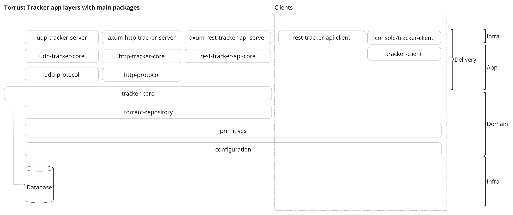

# Torrust Tracker Package Architecture

- [Package Conventions](#package-conventions)
- [Package Catalog](#package-catalog)
- [Architectural Philosophy](#architectural-philosophy)
- [Protocol Implementation Details](#protocol-implementation-details)
- [Architectural Philosophy](#architectural-philosophy)

```output
packages/
├── axum-health-check-api-server
├── axum-http-tracker-server
├── axum-rest-tracker-api-server
├── axum-server
├── clock
├── configuration
├── http-protocol
├── http-tracker-core
├── located-error
├── primitives
├── rest-tracker-api-client
├── rest-tracker-api-core
├── server-lib
├── test-helpers
├── torrent-repository
├── tracker-client
├── tracker-core
├── udp-protocol
├── udp-tracker-core
└── udp-tracker-server
```

```output
console/
└── tracker-client      # Client for interacting with trackers
```

```output
contrib/
└── bencode             # Community-contributed Bencode utilities
```

## Package Conventions

| Prefix          | Responsibility                          | Dependencies              |
|-----------------|-----------------------------------------|---------------------------|
| `axum-*`        | HTTP server components using Axum       | Axum framework            |
| `*-server`      | Server implementations                  | Corresponding *-core      |
| `*-core`        | Domain logic & business rules           | Protocol implementations  |
| `*-protocol`    | BitTorrent protocol implementations     | BitTorrent protocol       |
| `udp-*`         | UDP Protocol-specific implementations   | Tracker core              |
| `http-*`        | HTTP Protocol-specific implementations  | Tracker core              |

Key Architectural Principles:

1. **Separation of Concerns**: Servers contain only network I/O logic.
2. **Protocol Compliance**: `*-protocol` packages strictly implement BEP specifications.
3. **Extensibility**: Core logic is framework-agnostic for easy protocol additions.

## Package Catalog

| Package | Description | Key Responsibilities |
|---------|-------------|----------------------|
| **axum-*** | | |
| `axum-server` | Base Axum HTTP server infrastructure | HTTP server lifecycle management |
| `axum-http-tracker-server` | BitTorrent HTTP tracker (BEP 3/23) | Handle announce/scrape requests |
| `axum-rest-tracker-api-server` | Management REST API | Tracker configuration & monitoring |
| `axum-health-check-api-server` | Health monitoring endpoint | System health reporting |
| **Core Components** | | |
| `http-tracker-core` | HTTP-specific implementation | Request validation, Response formatting |
| `udp-tracker-core` | UDP-specific implementation | Connectionless request handling |
| `tracker-core` | Central tracker logic | Peer management |
| **Protocols** | | |
| `http-protocol` | HTTP tracker protocol (BEP 3/23) | Announce/scrape request parsing |
| `udp-protocol` | UDP tracker protocol (BEP 15) | UDP message framing/parsing |
| **Domain** | | |
| `torrent-repository` | Torrent metadata storage | InfoHash management, Peer coordination |
| `configuration` | Runtime configuration | Config file parsing, Environment variables |
| `primitives` | Domain-specific types | InfoHash, PeerId, Byte handling |
| **Utilities** | | |
| `clock` | Time abstraction | Mockable time source for testing |
| `located-error` | Diagnostic errors | Error tracing with source locations |
| `test-helpers` | Testing utilities | Mock servers, Test data generation |
| **Client Tools** | | |
| `tracker-client` | CLI client | Tracker interaction/testing |
| `rest-tracker-api-client` | API client library | REST API integration |

## Protocol Implementation Details

### HTTP Tracker (BEP 3/23)

- `http-protocol` implements:
  - URL parameter parsing
  - Response bencoding
  - Error code mapping
  - Compact peer formatting

### UDP Tracker (BEP 15)

- `udp-protocol` handles:
  - Connection ID management
  - Message framing (32-bit big-endian)
  - Transaction ID tracking
  - Error response codes

## Architectural Philosophy

1. **Testability**: Core packages have minimal dependencies for easy unit testing
2. **Observability**: Health checks and metrics built into server packages
3. **Modularity**: Protocol implementations decoupled from transport layers
4. **Extensibility**: New protocols can be added without modifying core logic



> Diagram shows clean separation between network I/O (servers), protocol handling, and core tracker logic
